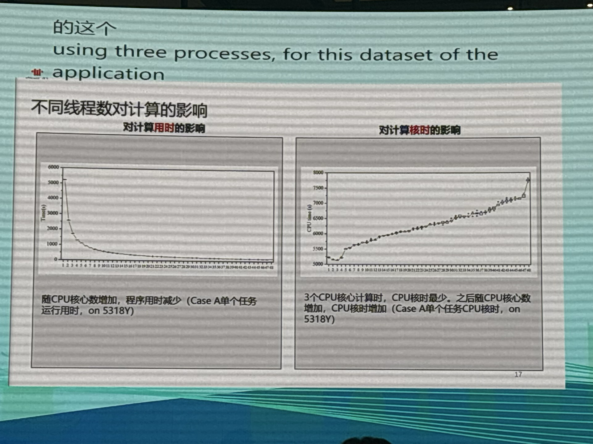
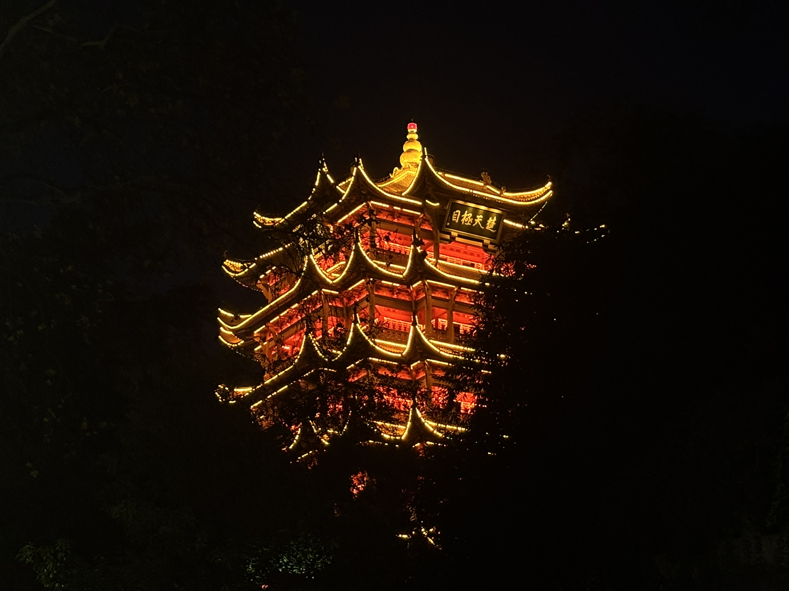
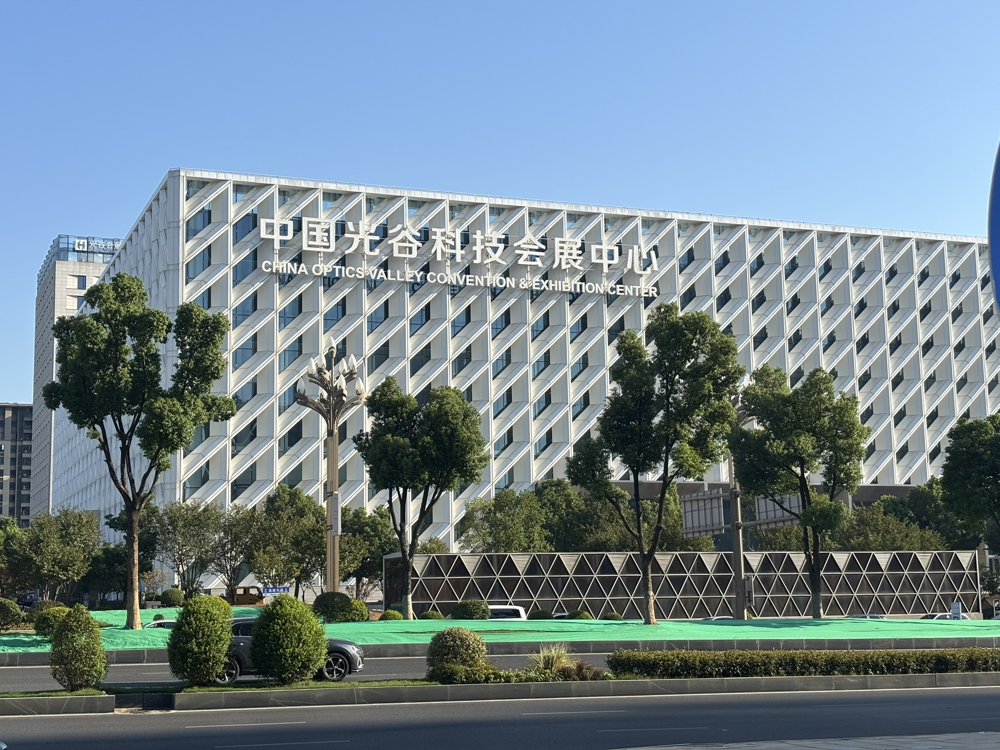
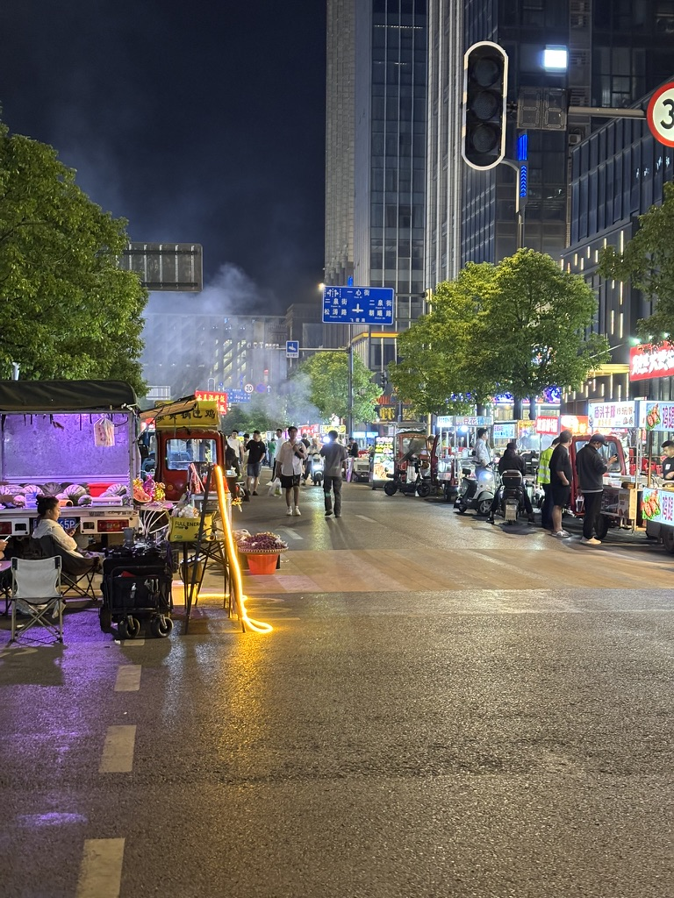
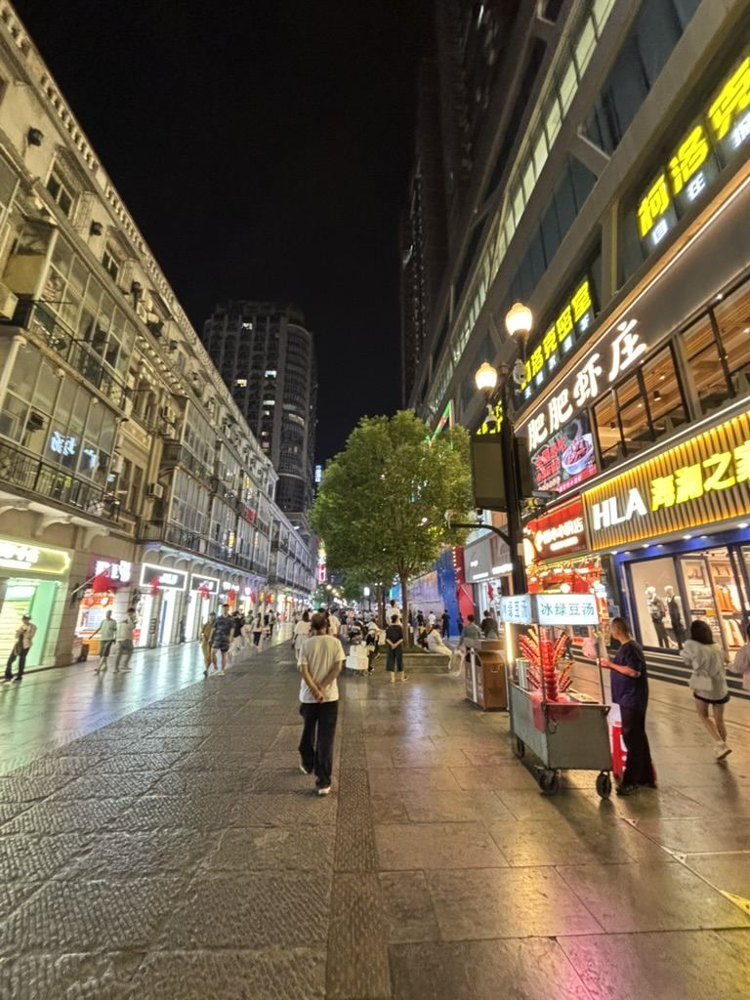
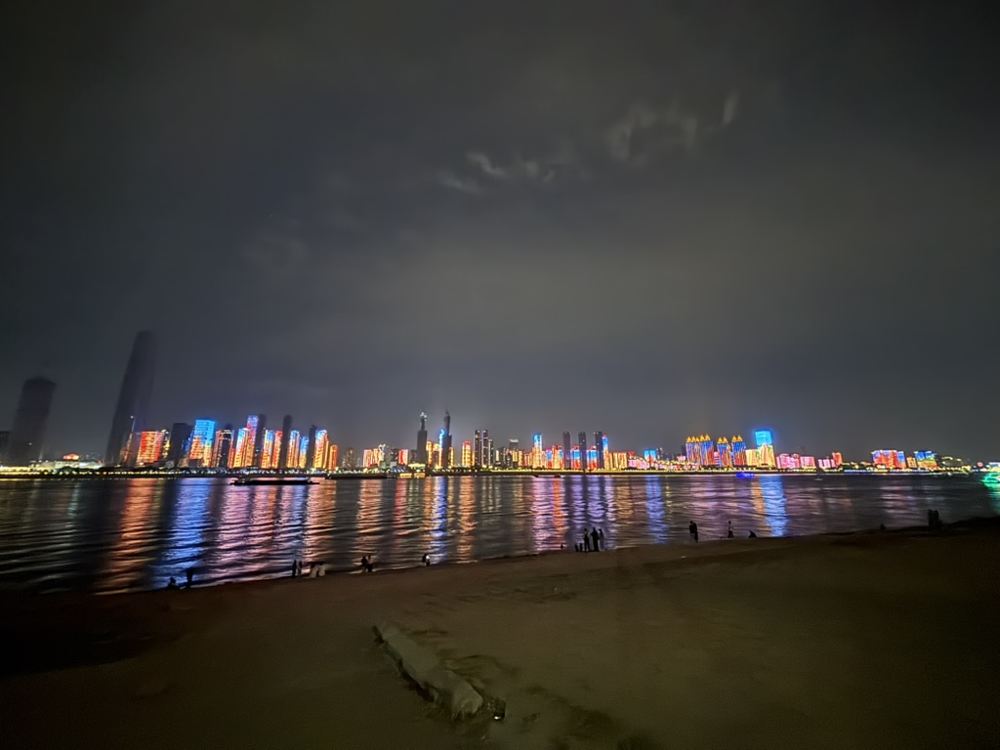
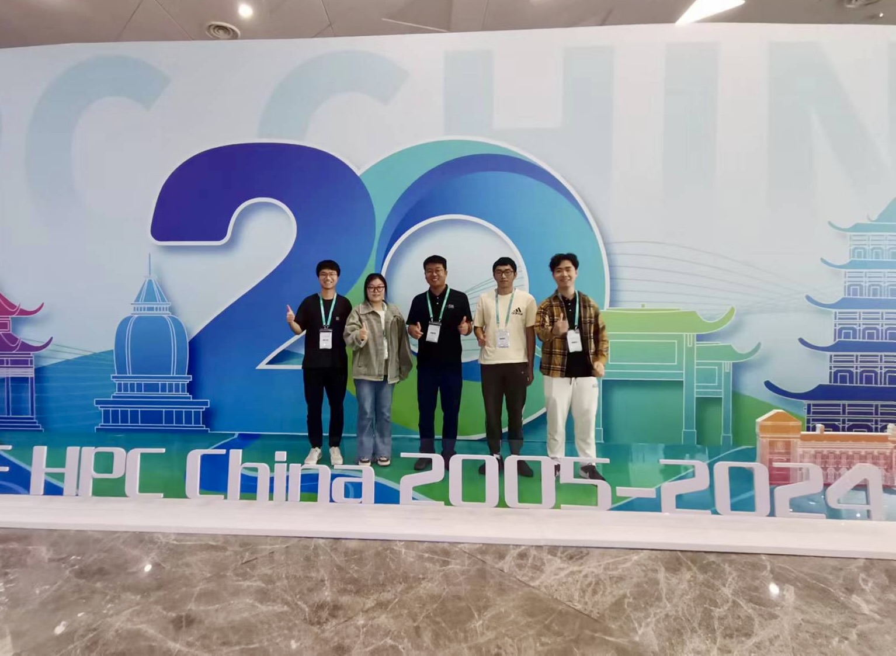
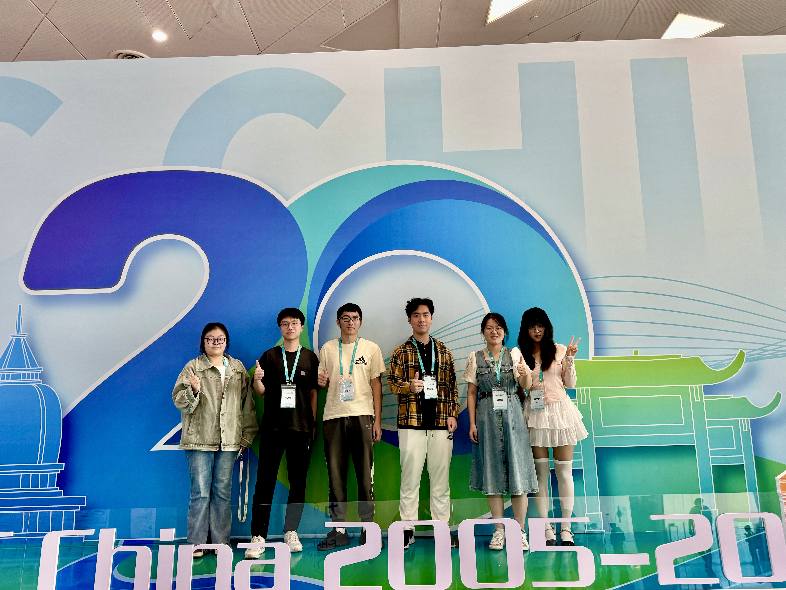

### 简介
参加CCF全国高性能计算学术年会（HPC CHINA 2024）的Trip Report

### 会议日程
HPC CHINA的日程分为两部分。前半程在主会场进行，邀请了多位院士和行业领袖进行主旨演讲与研究报告；后半程则划分为多个平行论坛，邀请了各领域的专家展示研究成果。与此同时，会展中心还举办了算力博览会（WEC 2024），许多企业展出了涵盖算力服务与硬件基础设施的展台。

### 报告亮点
**Dr. Pavan Balaj(Meta): A Deep Dive into Meta’s Massive Infrastructure Powering Llama3**。介绍了 Meta 用于训练 Llama3 的支持框架 “Grand Teton” 和硬件设备。他们使用了两台超算，24000张H100。他深入探讨了训练中的并行策略、数据存储以及内存瓶颈等关键技术细节，并指出随着规模扩大，系统面临的挑战发生了变化，性能的瓶颈往往不是硬件本身，而是能耗、物理布局及系统可靠性等物理因素。
>Scale changes everything. Raw performance is almost never the core problem. Performance is often constrained by power, physical layout,system reliability, and other physical constraints.  

这些万卡、十万卡的超大规模集群总是那么激动人心，这里面的资源调度、性能调优、能耗管理都是非常有意思的课题。  
会后多亏梦悦师姐带我们去social，喜提合影！

    
     
    

      与Pavan Balaj博士（左二）合影
  	

**曹振南（国家高性能计算机工程技术研究中心）： 建设超算互联网 推动超算生态发展**。曹老师描绘了超算互联网的宏伟蓝图，提出了许多令人耳目一新的想法。最令我印象深刻的是他的观点：
>“以后用算力就像用水用电一样”  

这让我感觉超算互联网想做的事情是很多的，同时也看到了它目前落地了一个卖卡时的电商网站，但它要走的路还很长，希望未来能在这里看到更多创新性的工作。

**杨海龙（北航）：面向高性能计算的细粒度值分析工具探索**。杨老师回顾了高性能计算领域的发展历程，并指出当今面临的几大关键问题:
>1. 不同应用需要的算力类型不同
>2. 从指令集、GPU到超算集群，计算机体系结构异构化日益显著
>3. 能耗问题是后E级超算时代的重大挑战  

他从目前自动性能分析工具的不足出发，介绍了他们团队的研究进展。他还提出了“Performance Trace Sharing Platform”的设想，旨在通过共享应用的性能分析数据，减少重复劳动，节省资源。杨老师也是超算队的指导老师，我发现超算比赛的内容和他介绍的这几个问题密切相关，或许他介绍的这几个工作可以用到未来的超算比赛当中。杨老师的报告逻辑缜密，思路清晰，让我受益匪浅。

**孔雷（北大）：面向实践的生命科学高性能集群性能评测及分析框架**。 孔老师介绍了生命科学计算应用的现状，指出了这些应用对于算力的需求是分散的、多样化的。随着实验技术的进步，生命科学研究中采集的数据量显著提升，并且要快于芯片性能的提升。他指出，计算能力成为了生命科学研究的核心竞争力，并提出了一系列针对生命科学计算的集群性能分析、评测框架。  
报告中，他对计算成本的评估尤为精彩。他通过对比不同线程数下的计算时间和核时消耗，直观地展示了随着线程数增加，计算时间迅速趋近于零，而核时却保持线性增长。他总结道：“使用三线程时核时最低。”这让我对算力的性价比有了更直观的理解。

    
     
    

      不同线程数对计算的影响
  	

如果算力的成本高昂，那么算力用户也将趋向于使用较少的线程数以减少计算核时，但这样会大幅增加计算用时，降低用户的研究工作效率。反之，如果我们能把算力的性价比、易用性提高，那自然就能提高用户的研究工作效率。

### 启发
在这次学术会议中，我不仅了解到目前业界和学界关注的核心课题，还接触到了许多新名词和新概念。作为一名本科生，遗憾的是很多报告的内容我尚未完全理解，这让我更加深刻地体会到自己知识储备的不足与能力的局限。但与此同时，这次经历也激发了我继续学习的动力。在与师兄师姐的交流中，我还学到了他们高效的工作和学习方法。总的来说，本科生参加学术会议会有本科生的收获，这次经历对我意义重大，希望未来能更多地参与科研工作，继续成长！Keep it up! Grow professionally!

### 武汉游记

    
     
    

      9月23日晚 黄鹤楼
  	

    
     
    

      9月23日晚 武汉长江大桥上
  	

    
     
    

      9月24日 光谷科技会展中心
  	

    
     
    

      9月24日晚 酒店后面的夜市
  	

    
     
    

      9月25日晚 江汉路
  	

    
     
    

      9月25日晚 黎黄陂路
  	

    
     
    

      9月25日晚 与江城的美好邂逅
  	

    
     
    

      9月27日 华科大
  	

    
     
    

      9月27日 华为教堂
  	

    
     

    
     

